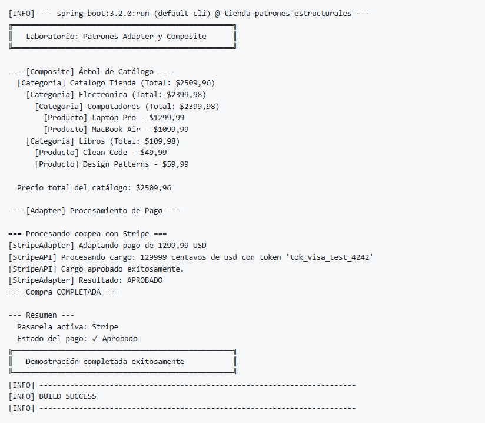
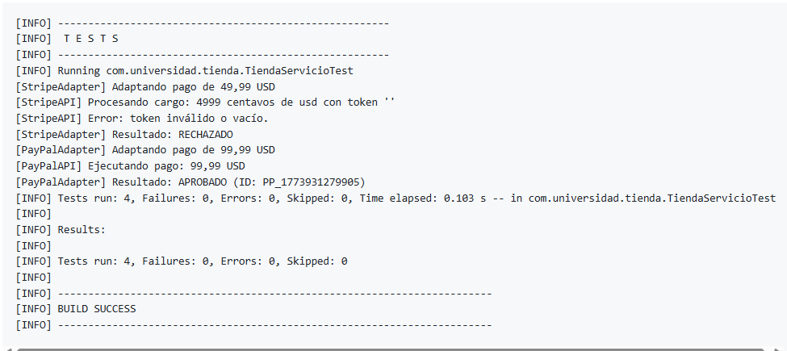

# Evidencias de Ejecución (Logs)

A continuación se presenta la salida real capturada de la consola al ejecutar los comandos de compilación, testeo y ejecución de la aplicación, como evidencia de que los patrones **Adapter** y **Composite** están funcionando correctamente.

## 1. Evidencia de Pruebas Unitarias (`mvn test`)

```text
[INFO] -------------------------------------------------------
[INFO]  T E S T S
[INFO] -------------------------------------------------------
[INFO] Running com.universidad.tienda.TiendaServicioTest
[StripeAdapter] Adaptando pago de 49,99 USD
[StripeAPI] Procesando cargo: 4999 centavos de usd con token ''
[StripeAPI] Error: token inválido o vacío.
[StripeAdapter] Resultado: RECHAZADO
[PayPalAdapter] Adaptando pago de 99,99 USD
[PayPalAPI] Ejecutando pago: 99,99 USD
[PayPalAdapter] Resultado: APROBADO (ID: PP_1773931279905)
[INFO] Tests run: 4, Failures: 0, Errors: 0, Skipped: 0, Time elapsed: 0.103 s -- in com.universidad.tienda.TiendaServicioTest
[INFO] 
[INFO] Results:
[INFO] 
[INFO] Tests run: 4, Failures: 0, Errors: 0, Skipped: 0
[INFO] 
[INFO] ------------------------------------------------------------------------
[INFO] BUILD SUCCESS
[INFO] ------------------------------------------------------------------------
```

## 2. Evidencia de Ejecución Principal (`mvn spring-boot:run`)

```text
[INFO] --- spring-boot:3.2.0:run (default-cli) @ tienda-patrones-estructurales ---
╔══════════════════════════════════════════════════╗
║   Laboratorio: Patrones Adapter y Composite      ║
╚══════════════════════════════════════════════════╝

--- [Composite] Árbol de Catálogo ---
  [Categoria] Catalogo Tienda (Total: $2509,96)
    [Categoria] Electronica (Total: $2399,98)
      [Categoria] Computadores (Total: $2399,98)
        [Producto] Laptop Pro - $1299,99
        [Producto] MacBook Air - $1099,99
    [Categoria] Libros (Total: $109,98)
      [Producto] Clean Code - $49,99
      [Producto] Design Patterns - $59,99

  Precio total del catálogo: $2509,96

--- [Adapter] Procesamiento de Pago ---

=== Procesando compra con Stripe ===
[StripeAdapter] Adaptando pago de 1299,99 USD
[StripeAPI] Procesando cargo: 129999 centavos de usd con token 'tok_visa_test_4242'
[StripeAPI] Cargo aprobado exitosamente.
[StripeAdapter] Resultado: APROBADO
=== Compra COMPLETADA ===

--- Resumen ---
  Pasarela activa: Stripe
  Estado del pago: ✓ Aprobado
╔══════════════════════════════════════════════════╗
║   Demostración completada exitosamente           ║
╚══════════════════════════════════════════════════╝
[INFO] ------------------------------------------------------------------------
[INFO] BUILD SUCCESS
[INFO] ------------------------------------------------------------------------
```

---

## Capturas de Pantalla Proporcionadas por el Usuario

A continuación se añaden las evidencias en formato de imagen de las ejecuciones exitosas en el entorno local.

### 1. Pruebas Unitarias de JUnit 5


### 2. Ejecución Completa de los Patrones

